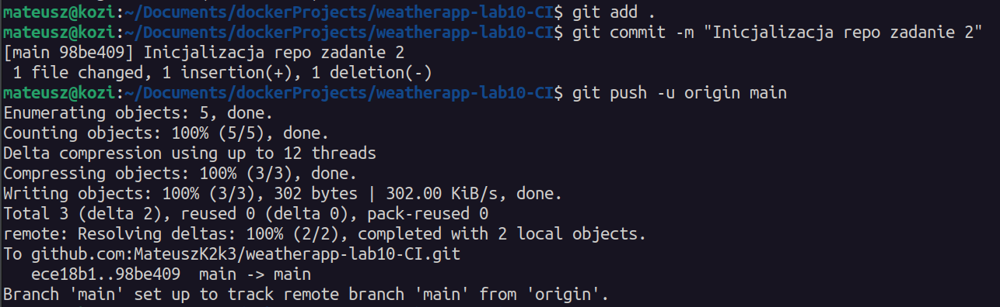
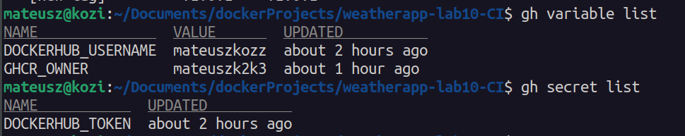
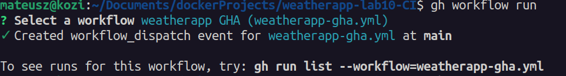
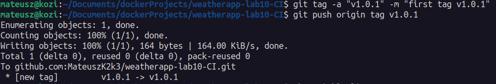
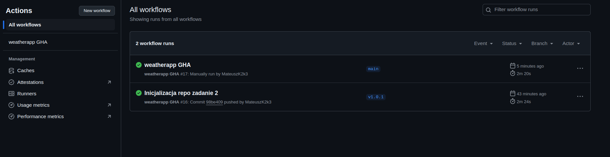

# Zadanie 2 - lab 10

## Konfiguracja i wykonanie GitHub Actions

### 1. Wykonanie pierwszego commita


---

### 2. Dodanie zmiennych i sekretów w repozytorium


#### Sekrety (Secrets)
- `DOCKERHUB_TOKEN` – access token do konta DockerHub 
- `GITHUB_TOKEN` – token GitHub (dostępny automatycznie, nie trzeba dodawać ręcznie)

#### Zmienne (Variables)
- `DOCKERHUB_USERNAME` – nazwa użytkownika DockerHub
- `GHCR_OWNER` - nazwa repozytorium na githubie

---

### 3. Sposób tagowania obrazów
posługując się źródłem:
https://www.docker.com/blog/docker-best-practices-using-tags-and-labels-to-manage-docker-image-sprawl/#:~:text=One%20way%20to%20address%20this,know%20what%20version%20you%20are

Wybrałem tagowanie obrazów "semver", ponieważ pozwalaja dokładnie określić, którą wersję obrazu Docker wdrażamy. Oficjalny blog Docker’a zauważa, że tagowanie obrazów zgodnie z SemVer sprawia, iż „wiemy, którą wersję wdrażamy”

```yaml
-   name: Extract Docker metadata (tags)
            id: meta
            uses: docker/metadata-action@v5
            with:
                images: ${{ env.GHCR_REPO }}
                flavor: latest=false
                tags: |
                    type=semver,pattern={{version}},priority=200
                    type=sha,prefix=sha-,format=short,priority=100
```

---

### 4. Budowanie obrazu do analizy oraz scan CVE (trivy)
```yaml
-   name: Build amd64, load locally
            id: build-amd64
            uses: docker/build-push-action@v4
            with:
                context: .
                file: ./Dockerfile
                platforms: linux/amd64
                push: false
                tags: ${{ steps.meta.outputs.tags }}
                cache-from: |
                    type=registry,ref=${{ env.DOCKERHUB_REPO }}:cache
                cache-to: |
                    type=registry,ref=${{ env.DOCKERHUB_REPO }}:cache,mode=max
                load: true

        -   name: Scan CVE (Trivy)
            id: trivy-scan
            uses: aquasecurity/trivy-action@0.28.0
            with:
                image-ref: ${{ env.GHCR_REPO }}:${{ steps.meta.outputs.version }}
                format: 'table'
                exit-code: '1' 
                severity: 'CRITICAL,HIGH'
            continue-on-error: true

        -   name: Fail if CVE found
            if: steps.trivy-scan.outcome == 'failure'
            run: |
                echo "Krytyczne lub wysokie CVE wykryte. Przerywam workflow."
                exit 1
```
Krok Build amd64 korzysta z docker/build-push-action, by zbudować obraz dla platformy linux/amd64, załadować go lokalnie (load: true) i przypisać mu tagi wygenerowane wcześniej przez akcję metadata-action. Obraz nie jest wypychany (push: false), a cache jest synchronizowany z rejestrem Dockera, co przyspiesza kolejne buildy.

Krok Scan CVE (Trivy) wykorzystuje aquasecurity/trivy-action, by przeskanować zbudowany obraz (z tagiem opartym na semver, np. v1.0.1) pod kątem podatności o poziomie CRITICAL i HIGH. Wykorzystuje format tabeli, ustawia exit-code: 1, ale dzięki continue-on-error: true nie przerywa workflow natychmiast po wykryciu błędu.

---

### 5. Budowanie i "push" obrazu do GitHub Container Registry
```yaml
-   name: Push image to GitHub Container Registry
            if: steps.trivy-scan.outcome == 'success'
            uses: docker/build-push-action@v5
            with:
                context: .
                file: ./Dockerfile
                platforms: linux/amd64,linux/arm64
                push: true
                tags: |
                    ${{ steps.meta.outputs.tags }}
                    ${{ env.GHCR_REPO }}:latest
                cache-from: type=registry,ref=${{ env.DOCKERHUB_REPO }}:cache
                cache-to: type=registry,ref=${{ env.DOCKERHUB_REPO }}:cache,mode=max
```

Krok "Push image to GitHub Container Registry" wypycha obraz tylko gdy trivy nie zgłosi krytycznych podatności. "platforms: linux/amd64,linux/arm64" – obraz zostaje zbudowany wieloplatformowo (w tym dla architektury ARM, np. Raspberry Pi)."cache-from" i "cache-to" – konfiguruje cache warstw Dockera w DockerHub, by przyspieszyć przyszłe buildy.

---

## Wykonanie Github Action

### 1. użycie workflow_dispatch


### 2. uzycie git tags


## potwiedzienie działania

